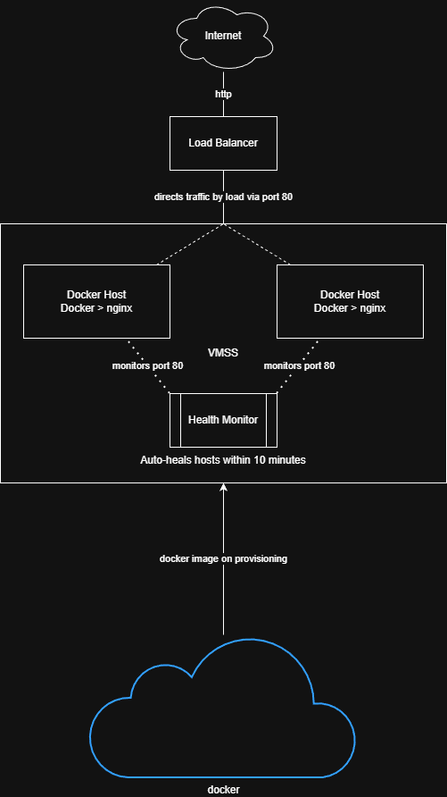

# Auto-Healing Web Tier on Azure
==============================

A fully automated, self-healing web infrastructure deployed on Azure using Terraform. Features containerised NGINX, automatic instance replacement, and N+1 high availability.

Features
--------

-   **Self-Healing**: Failed instances automatically replaced within 15-20 minutes
-   **Self-Provisioning**: One command deploys everything
-   **N+1 Capacity**: Minimum 2 instances behind load balancer; can survive single VM failure with zero downtime
-   **Containerised**: NGINX runs in Docker containers for consistent deployments
-   **Web Container Agnostic**: Can run any web container via passing variable on ```terraform apply```
-   **Zone-Redundant**: VMs distributed across 3 availability zones

Configuration Options
---------------------

### Variables

| Variable | Default | Description |
| --- | --- | --- |
| `location` | `"New Zealand North"` | Azure region for deployment |
| `resource_group_name` | `"rg-web-demo"` | Name of the resource group |
| `vm_size` | `"Standard_B1s"` | Azure VM size |
| `docker_image` | `"joshdevicarite/custom-nginx:latest"` | Docker image to run on hosts |
| `instance_count` | `2` | Number of VMs (minimum 2 for N+1) for fixed capacity |

### Customizing Deployment

```
# Different region, more instances and VM size
terraform apply\
  -var="location=West Europe"\
  -var="vm_size=Standard_B2s"\
  -var="instance_count=5"\
  -var="docker_image=EXAMPLEUSERNAME/nginx:alpine"
```

Architecture Details
--------------------



### Components

-   **Resource Group**: Container for all resources
-   **Virtual Network**: Isolated network (10.0.0.0/16)
-   **Subnet**: Web tier subnet (10.0.1.0/24)
-   **Network Security Group**: Firewall rules (allows HTTP on port 80)
-   **Public IP**: Static IP for load balancer
-   **Load Balancer**: Distributes traffic across VMs
-   **Health Probe**: HTTP checks on port 80 every 15 seconds
-   **Virtual Machine Scale Set**: Manages 2 identical VMs across a potential 3 zones for redundancy
-   **Application Health Extension**: Monitors app health from inside VM
-   **Autoscaler**: Enforces a fixed capacity of 2 instances

### Auto-Healing Process

1.  Health extension detects application failure
2.  Grace period: 10 minutes (prevents false positives)
3.  If still unhealthy, automatic repair deletes VM
4.  VMSS detects instance count below desired (2)
5.  VMSS creates replacement VM
6.  New VM boots, runs cloud-init
7.  Docker installed, image pulled, container started
8.  Health checks pass, VM added to load balancer

**Total recovery time:** 15-20 minutes with zero user-facing downtime.


Prerequisites
-------------

### Required Tools

-   [Terraform](https://www.terraform.io/downloads) v1.0 or higher
-   [Azure CLI](https://docs.microsoft.com/en-us/cli/azure/install-azure-cli)

### Azure Requirements

-   Active Azure subscription
-   Contributor access to create resources

### Authentication

```
# Login to Azure
az login

# Verify subscription
az account show
```

Quick Start
-----------

### 1\. Deploy Infrastructure

```
# Initialize Terraform (downloads providers)

# Preview changes
terraform plan

# Deploy infrastructure
terraform apply
```

Type `yes` when prompted to confirm.

**Expected deployment time:** 5-8 minutes

### 2\. Access Application

```
# Get the load balancer URL
terraform output load_balancer_url

# Test it
curl $(terraform output -raw load_balancer_url)
```


Cost Estimate
-------------

**Monthly costs (approximate):**

-   2× Standard_B1s VMs: ~$20
-   Load Balancer (Standard): ~$20
-   Public IP (Standard): ~$4
-   **Total: ~$44/month**


Assumptions and Compromises
-------------

This is a demonstration and as such a number of decisions make this completely unsuitable for production.

-   SSH keys are stored in the Terraform state
-   HTTPS is not implemented
-   No additional security hardening has been implemented
-   No form of access into the instances outside of invoking Azure run-command, as port 22 is locked down
-   Not possible to deploy solution for less than AUD $20 on Azure, but it's what I know best and I've minimised costs as best I can.
